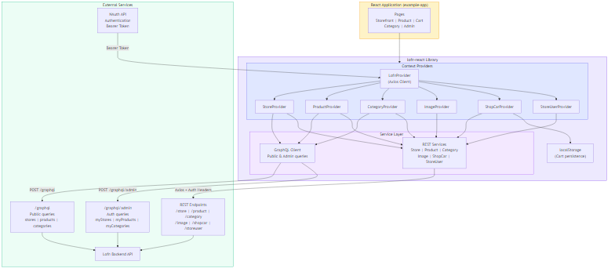

# lofn-react - React SDK for Lofn Ecommerce API


## Overview

**lofn-react** is an NPM React component library and SDK for integrating with the Lofn ecommerce platform API. It provides context providers, hooks, service classes, and pre-built admin UI components for managing stores, products, categories, images, shopping carts, and store users. Built using **React**, **TypeScript**, **Tailwind CSS**, and **Axios**, with **GraphQL** support via HotChocolate.

The library is designed as a plug-and-play solution — wrap your app with providers, use hooks in your components, and you have a fully typed, authenticated ecommerce frontend.

Authentication is handled via **[nauth-react](https://github.com/emaginebr/nauth-react)**, which provides Bearer tokens that are automatically injected into all API requests.

---

## 🚀 Features

- 🏪 **Store Management** - CRUD de lojas com upload de logomarca, GraphQL queries e status management
- 📦 **Product Management** - Criacao, edicao, busca paginada, imagens multiplas e produtos em destaque
- 🏷️ **Category Management** - Categorias vinculadas a lojas com contagem de produtos
- 🖼️ **Image Upload** - Upload multipart com ordenacao e gerenciamento visual
- 🛒 **Shopping Cart** - Carrinho local com persistencia em localStorage e envio ao backend
- 👥 **Store Users** - Gerenciamento de membros/usuarios por loja
- 🔐 **Authentication** - Integracao automatica com NAuth (Bearer token em todas as requests)
- 🔍 **GraphQL + REST** - Queries via GraphQL (public + admin) e mutations via REST
- 🎨 **Pre-built Components** - Componentes admin prontos (listas, formularios, badges, paginacao)
- 🌙 **Dark Mode** - Suporte completo a dark mode via Tailwind CSS
- 📱 **Responsive** - Todos os componentes responsivos com mobile-first approach

---

## 🛠️ Technologies Used

### Core Framework
- **React** `^18.3 || ^19` - UI library com Context API para state management
- **TypeScript** `^5.8` - Tipagem estatica completa em toda a codebase

### HTTP & API
- **Axios** `^1.11` - HTTP client com interceptors para auth e error handling
- **GraphQL** - Queries publicas e autenticadas via HotChocolate

### Styling
- **Tailwind CSS** `^3.4` - Utility-first CSS com dark mode (class strategy)
- **Radix UI** - Primitivos acessiveis para Button, Input, Label, Avatar
- **class-variance-authority** `^0.7` - Variantes de componentes

### Authentication
- **nauth-react** `^0.7` - Peer dependency para autenticacao (Bearer token)

### Build & Tooling
- **Vite** `^5.4` - Build em library mode (ES + CJS) com source maps
- **vite-plugin-dts** - Geracao automatica de type declarations

### Testing
- **Vitest** `^1.2` - Test runner com jsdom environment
- **Testing Library** - React testing utilities
- **Storybook** `^7.6` - Component development e documentacao visual

### Additional Libraries
- **clsx** + **tailwind-merge** - Utilitario `cn()` para merge seguro de classes Tailwind
- **react-router-dom** `^6.30 || ^7` - Peer dependency para routing

---

## 📁 Project Structure

```
lofn-react/
├── src/                         # Library source code
│   ├── components/              # React UI components
│   │   ├── ui/                  # Base components (Button, Input, Label, Avatar)
│   │   ├── shared/              # Shared utilities (LoadingOverlay, EmptyState, StatusBadge, Pagination, etc.)
│   │   ├── StoreList.tsx        # Admin — store listing
│   │   ├── StoreForm.tsx        # Admin — store create/edit form
│   │   ├── ProductList.tsx      # Admin — product listing
│   │   ├── ProductForm.tsx      # Admin — product create/edit form
│   │   ├── ProductImageManager.tsx  # Admin — product image upload/sort
│   │   ├── CategoryList.tsx     # Admin — category listing
│   │   ├── CategoryForm.tsx     # Admin — category create/edit form
│   │   └── StoreUserList.tsx    # Admin — store members management
│   ├── contexts/                # React Context providers
│   │   ├── LofnContext.tsx      # Base provider (Axios client + auth)
│   │   ├── StoreContext.tsx     # Store CRUD + GraphQL queries
│   │   ├── ProductContext.tsx   # Product CRUD + GraphQL queries
│   │   ├── CategoryContext.tsx  # Category CRUD + GraphQL queries
│   │   ├── ImageContext.tsx     # Image upload/list/delete
│   │   ├── ShopCarContext.tsx   # Shopping cart (local + API)
│   │   └── StoreUserContext.tsx # Store user management
│   ├── services/                # API service classes
│   │   ├── apiClient.ts         # Axios instance factory with interceptors
│   │   ├── graphqlClient.ts     # GraphQL query wrapper (public + admin)
│   │   ├── productService.ts    # Product REST + GraphQL
│   │   ├── categoryService.ts   # Category REST + GraphQL
│   │   ├── storeService.ts      # Store REST + GraphQL
│   │   ├── imageService.ts      # Image upload REST
│   │   ├── shopCarService.ts    # Shopping cart REST
│   │   └── storeUserService.ts  # Store user REST
│   ├── hooks/                   # Custom hooks (re-exports from contexts)
│   ├── types/                   # TypeScript definitions (interfaces, enums, endpoints)
│   ├── styles/                  # Global Tailwind CSS styles
│   ├── utils/                   # Utilities (cn.ts)
│   ├── __tests__/               # Test setup
│   └── index.ts                 # Public API — all exports
├── example-app/                 # Reference implementation (Vite + React app)
│   ├── src/
│   │   ├── pages/               # Storefront, Product, Cart, Category, Admin pages
│   │   ├── components/          # Layout, Navbar, AdminLayout, UserMenu
│   │   └── App.tsx              # Router + full provider nesting
│   ├── Dockerfile               # Multi-stage Docker build (Node + Nginx)
│   └── .env.example             # Environment template
├── docs/                        # Documentation
├── .github/workflows/           # CI/CD (GitVersion, NPM publish, GitHub releases)
├── vite.config.ts               # Library build configuration
├── tailwind.config.js           # Tailwind theming
├── vitest.config.ts             # Test configuration
└── package.json                 # Dependencies & scripts
```

### Ecosystem

| Project | Type | Description |
|---------|------|-------------|
| **[nauth-react](https://github.com/emaginebr/nauth-react)** | NPM Package | React SDK para autenticacao (peer dependency) |
| **lofn-react** (this) | NPM Package | React SDK para API Lofn (ecommerce) |
| **Lofn Backend** | .NET API | Backend API com REST + GraphQL (HotChocolate) |

#### Dependency graph

```
nauth-react (auth)
    └── lofn-react (ecommerce SDK)
            └── Your App (example-app)
```

---

## 🏗️ System Design

The following diagram illustrates the high-level architecture of **lofn-react**:



The library sits between the consuming React application and the Lofn Backend API. **LofnProvider** creates a shared Axios instance with auth headers from NAuth. Domain providers (Store, Product, Category, etc.) wrap service classes that call REST endpoints for mutations and GraphQL endpoints for queries. The **ShopCarProvider** additionally persists cart state to `localStorage` for offline resilience.

> 📄 **Source:** The editable Mermaid source is available at [`docs/system-design.mmd`](docs/system-design.mmd).

---

## 📖 Additional Documentation

| Document | Description |
|----------|-------------|
| [API_REFERENCE](docs/API_REFERENCE.md) | Referencia completa da API REST e GraphQL do backend Lofn (endpoints, DTOs, enums, exemplos) |

---

## ⚙️ Environment Configuration

The example-app requires environment variables for API connections:

### 1. Copy the environment template

```bash
cd example-app
cp .env.example .env
```

### 2. Edit the `.env` file

```bash
# NAuth authentication API URL
VITE_API_URL=http://localhost:3000

# Lofn ecommerce backend API URL
VITE_LOFN_API_URL=https://localhost:44374

# Tenant ID for multi-tenant support
VITE_TENANT_ID=your-tenant-id
```

⚠️ **IMPORTANT**:
- Never commit the `.env` file with real credentials
- Only the `.env.example` should be version controlled
- The library itself does not require env vars — configuration is passed via `LofnProvider` props

---

## 🐳 Docker Setup

The example-app includes a multi-stage Dockerfile (Node 20 + Nginx):

### Build and Run

```bash
cd example-app
docker build \
  --build-arg VITE_API_URL=https://your-api.com/auth \
  --build-arg VITE_TENANT_ID=your-tenant-id \
  -t lofn-app .

docker run -p 80:80 lofn-app
```

### Accessing the Application

| Service | URL |
|---------|-----|
| **Lofn App** | http://localhost:80 |

---

## 🔧 Manual Setup

### Prerequisites

- **Node.js** >= 20
- **npm** >= 9

### Setup Steps

#### 1. Install library dependencies and build

```bash
npm install
npm run build
```

#### 2. Install example-app dependencies

```bash
cd example-app
npm install
```

#### 3. Configure environment

```bash
cp .env.example .env
# Edit .env with your API URLs and tenant ID
```

#### 4. Run the example-app

```bash
npm run dev
```

The app will be available at `http://localhost:5173/lofn`.

---

## 🧪 Testing

### Running Tests

**All Tests:**
```bash
npm run test
```

**Watch Mode:**
```bash
npm run test:watch
```

**With Coverage:**
```bash
npm run test:coverage
```

**Type Check Only:**
```bash
npm run type-check
```

**Lint:**
```bash
npm run lint
```

---

## 📚 API Documentation

### Authentication Flow

```
1. User logs in via NAuth → 2. NAuth returns Bearer token → 3. LofnProvider injects token in all requests → 4. Backend validates via NAuth
```

### Provider Hierarchy (required nesting order)

```tsx
<NAuthProvider config={...}>
  <LofnProvider config={{ apiUrl, tenantId }}>
    <StoreProvider>
      <ProductProvider>
        <CategoryProvider>
          <ImageProvider>
            <ShopCarProvider>
              <StoreUserProvider>
                {/* Your app */}
              </StoreUserProvider>
            </ShopCarProvider>
          </ImageProvider>
        </CategoryProvider>
      </ProductProvider>
    </StoreProvider>
  </LofnProvider>
</NAuthProvider>
```

### REST Endpoints Summary

| Method | Endpoint | Description | Auth |
|--------|----------|-------------|------|
| POST | `/product/{storeSlug}/insert` | Create product | Yes |
| POST | `/product/{storeSlug}/update` | Update product | Yes |
| POST | `/product/search` | Search products (paginated) | No |
| POST | `/category/{storeSlug}/insert` | Create category | Yes |
| POST | `/category/{storeSlug}/update` | Update category | Yes |
| DELETE | `/category/{storeSlug}/delete/{id}` | Delete category | Yes |
| POST | `/image/upload/{productId}` | Upload image (multipart) | Yes |
| GET | `/image/list/{productId}` | List product images | Yes |
| DELETE | `/image/delete/{imageId}` | Delete image | Yes |
| POST | `/store/insert` | Create store | Yes |
| POST | `/store/update` | Update store | Yes |
| POST | `/store/uploadLogo/{storeId}` | Upload store logo | Yes |
| DELETE | `/store/delete/{storeId}` | Delete store | Yes |
| POST | `/shopcar/insert` | Create shopping cart | Yes |
| GET | `/storeuser/{storeSlug}/list` | List store users | Yes |
| POST | `/storeuser/{storeSlug}/insert` | Add user to store | Yes |
| DELETE | `/storeuser/{storeSlug}/delete/{id}` | Remove user from store | Yes |

### GraphQL Endpoints

| Endpoint | Auth | Queries |
|----------|------|---------|
| `/graphql` | No | `stores`, `products`, `categories`, `storeBySlug`, `featuredProducts` |
| `/graphql/admin` | Yes | `myStores`, `myProducts`, `myCategories` |

---

## 📦 Integration

### Using lofn-react in Your Application

#### 1. Install the package

```bash
npm install lofn-react nauth-react react-router-dom
```

#### 2. Import styles

```tsx
import 'lofn-react/styles';
```

#### 3. Wrap your app with providers

```tsx
import { LofnProvider, StoreProvider, ProductProvider, useStore, useProduct } from 'lofn-react';

function App() {
  return (
    <NAuthProvider config={{ apiUrl: '...', tenantId: '...' }}>
      <LofnProvider config={{ apiUrl: '...', tenantId: '...' }}>
        <StoreProvider>
          <ProductProvider>
            <MyApp />
          </ProductProvider>
        </StoreProvider>
      </LofnProvider>
    </NAuthProvider>
  );
}
```

#### 4. Use hooks in your components

```tsx
import { useStore, useProduct, useShopCar } from 'lofn-react';

function StorePage() {
  const { listActiveStores } = useStore();
  const { listFeatured } = useProduct();
  const { addItem, itemCount } = useShopCar();

  // ...
}
```

#### 5. Use pre-built admin components

```tsx
import { ProductList, ProductForm, CategoryList, StoreList } from 'lofn-react';

function AdminPage() {
  return <ProductList storeSlug="my-store" onSelect={(p) => console.log(p)} />;
}
```

---

## 🔄 CI/CD

### GitHub Actions

The project uses three automated workflows:

**1. Version and Tag** (`version-tag.yml`)
- **Trigger:** Push to `main` branch
- **Steps:** Uses GitVersion to determine semantic version, creates and pushes git tag

**2. Publish to NPM** (`npm-publish.yml`)
- **Trigger:** Push of `v*` tags or manual dispatch
- **Steps:** Install → Build → Set version → `npm publish`

**3. Create Release** (`create-release.yml`)
- **Trigger:** After successful "Version and Tag" workflow
- **Steps:** Detects major/minor version changes, creates GitHub Release with auto-generated notes (skips patch-only changes)

---

## 🤝 Contributing

Contributions are welcome! Please feel free to submit a Pull Request.

### Development Setup

1. Fork the repository
2. Create a feature branch (`git checkout -b feature/AmazingFeature`)
3. Make your changes
4. Build the library (`npm run build`)
5. Type-check the example-app (`cd example-app && npx tsc --noEmit`)
6. Run tests (`npm run test`)
7. Commit your changes (`git commit -m 'Add some AmazingFeature'`)
8. Push to the branch (`git push origin feature/AmazingFeature`)
9. Open a Pull Request

### Coding Standards

- TypeScript strict mode — no `any` (warning)
- Tailwind CSS for all styling — dark mode variants required
- All public APIs exported from `src/index.ts`
- UI text in Portuguese (pt-BR)
- Path alias `@/*` → `./src/*` within library source

---

## 👨‍💻 Author

Developed by **[Rodrigo Landim](https://github.com/emaginebr)**

---

## 📄 License

This project is licensed under the **MIT License** - see the [LICENSE](LICENSE) file for details.

---

## 🙏 Acknowledgments

- Built with [React](https://react.dev) and [TypeScript](https://www.typescriptlang.org)
- Styled with [Tailwind CSS](https://tailwindcss.com) and [Radix UI](https://www.radix-ui.com)
- HTTP via [Axios](https://axios-http.com)
- Auth powered by [nauth-react](https://github.com/emaginebr/nauth-react)
- Bundled with [Vite](https://vitejs.dev)

---

## 📞 Support

- **Issues**: [GitHub Issues](https://github.com/emaginebr/lofn-react/issues)

---

**⭐ If you find this project useful, please consider giving it a star!**
